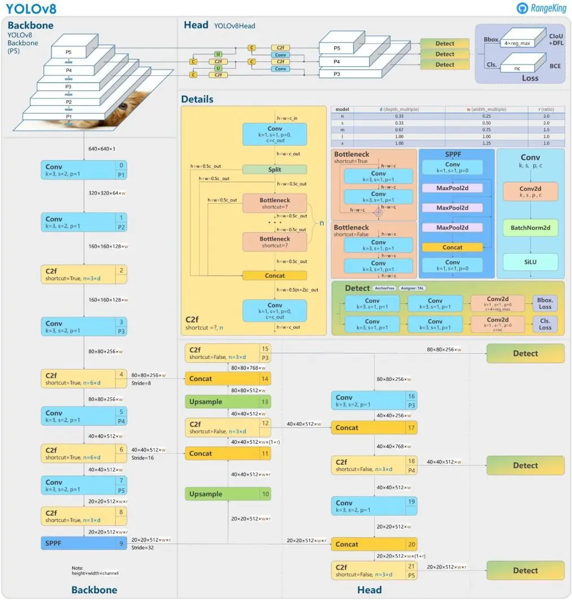
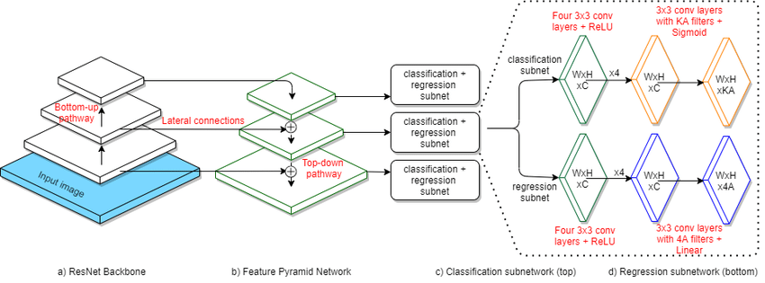
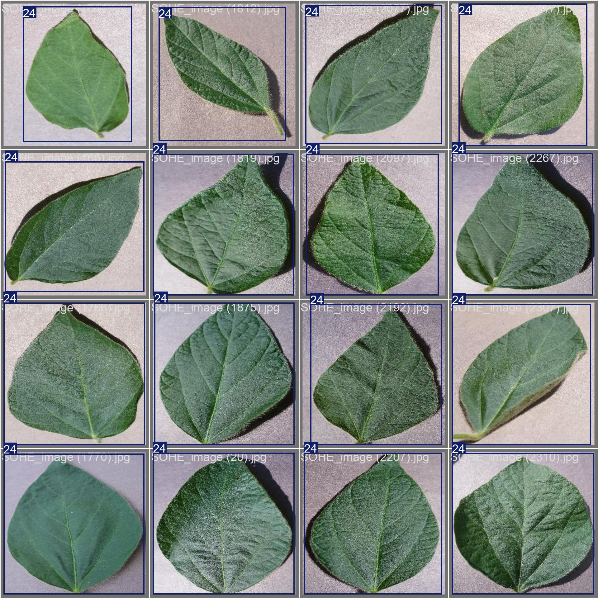
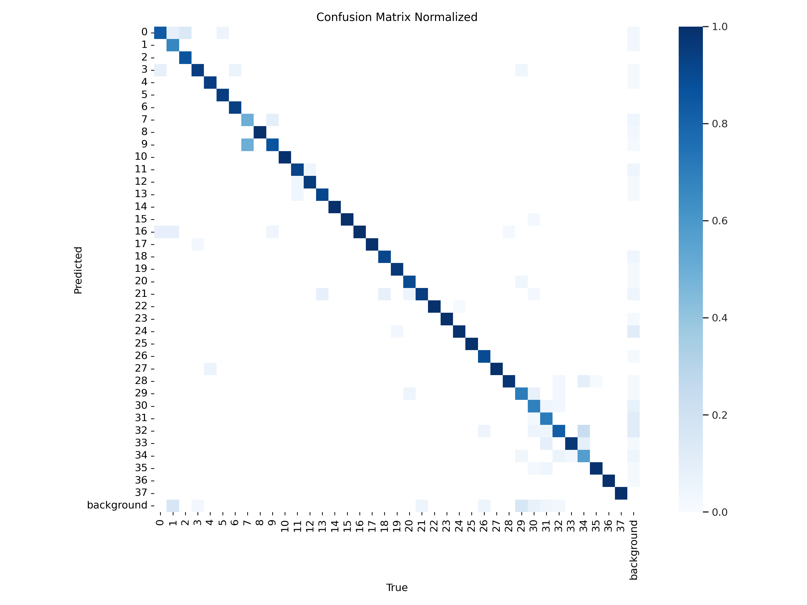

#  Plant Object Detection & Classification

This project applies deep learning models — YOLOv8 and RetinaNet (ResNet50-FPN) — to detect and classify plant-related objects in images. It is designed to support applications such as disease diagnosis, plant health monitoring, and species recognition, using custom-labeled datasets in object detection format. Total 39 classes in the dataset

Train and evaluate YOLOv8 and RetinaNet models.

Detect plant parts or anomalies (leaves, fruits, diseases, etc.).

Visualize results with bounding boxes and class labels.

Support for YOLO-style dataset annotation:
class_id center_x center_y width height 

## YOLOv8 (You Only Look Once, Version 8)
YOLOv8 is a single-stage object detector with high speed and accuracy. It includes:

Backbone: CSPDarknet (customized for YOLOv8)

Neck: PAN-FPN for multi-scale feature fusion

Head: Decoupled detection head with objectness, classification, and regression branches

### Architecture:

YOLOv8’s architecture is presented by GitHub user RangeKing

##  RetinaNet 
RetinaNet is another single-stage detector that uses Focal Loss to address class imbalance in dense detection tasks. Key components:

Backbone: ResNet-50

Neck: Feature Pyramid Network (FPN) for scale-aware detection

Head: Subnetworks for classification and bounding box regression

### Architecture:

Image taken from [this paper](https://www.researchgate.net/publication/346881433/figure/fig1/AS:986672187600896@1612252389239/RetinaNet-architecture-4-The-bottom-up-pathway-is-a-feedforward-ResNet-Architecture.ppm)

    plant_object_detection/
    ├── dataset/
    │   ├── images/          # Train/val/test images
    │   └── labels/          # Annotations in Text format
    ├──retina_model_save/
    │   ├── model0.pth  
    ├── yolov8n.pt
    │   └── retinanet.pth
    │
    ├── train_yolov8.ipynb
    ├── train_retinanet.ipynb
    └── README.md

## Requirement
    Python 3.8+
    PyTorch
    torchvision
    Ultralytics (for YOLOv8)
    OpenCV
    matplotlib
    albumentations (optional)

## Result of YOLOv8 (You Only Look Once, Version 8)
### Label

### Prediction using Yolo v8 with confidence score

### Confusion matrix (Normalized version)
